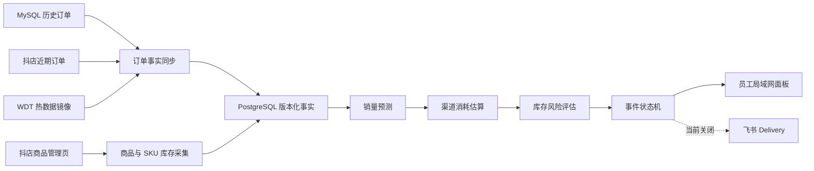

# 抖店库存预测工作流交接文档

> 文档用途：迁移后的工程与生产交接。
> 事实快照时间：2026-08-06 16:20（Asia/Shanghai）。
> 当前代码版本：BPA `0.6.0`，库存应用 `0.1.0`。
> 当前执行接管：Codex；代码、生产运维和业务评审的长期负责人仍待确认。
> 保密要求：本文不记录数据库口令、浏览器 Cookie、验证码、会话令牌或飞书 Webhook。

## 1. 交接结论

13 家店铺的库存、订单、预测和风险事实均已进入 PostgreSQL，后台服务与员工局域网页面在线。2026-08-06 16:19 已通过唯一 launchd 入口完成一轮 13/13 生产采集，控制面和数据面恢复工作状态。当前可按“已恢复、继续观察”交接；一次成功不能替代连续 48 个半小时周期和 24 小时以上 SLO 验收。

| 项目 | 当前结论 | 证据 |
| --- | --- | --- |
| 代码迁移 | 已完成目录迁移 | 本地代码仓库已迁至 `/Users/yibazhua/Documents/01-core-products/BPA`；旧路径 `/Users/yibazhua/Documents/BPA` 不存在，也未建立兼容软链接 |
| 服务与页面 | 在线 | `com.bpa.core`、`com.bpa.inventory-monitor` 正在运行；`http://192.168.3.135:17650/` 返回 HTTP 200 |
| 数据入库 | 已有完整历史事实 | 13 店、319 商品、777 个有效 SKU 绑定、1,118 个渠道商品 ID、3,534,794 条订单事实 |
| 最近一次完整成功 | 已完成 | 15:56:02 至 16:19:04，13/13 canary、订单、库存和风险全部成功，诊断为空 |
| 当前自动巡检 | 已恢复，待连续验收 | launchd 最后退出码 0；结束后进程、PostgreSQL Lease、Browser Control Lease 和运行中批次均归零 |
| 当前新鲜度 | 满足本轮生产判断 | 13/13 库存、13/13 订单和 13/13 风险已在同一成功轮中完成 |
| 当前业务风险 | 有历史开放事件，但不可直接视为最新结论 | 数据库有 3 个开放 `critical` 事件，最后评估时间为 09:57；当前输入已过期，必须刷新并重算后再处置 |
| 通知 | 安全关闭 | 飞书日报和异常提醒两个 launchd 标签均为 disabled，当前不会发送库存通知 |
| 备份 | 正常 | 2026-08-06 03:16 最新 dump 校验通过，具备本地日/周备份及 age 加密离机副本 |
| Git 可追溯性 | P0 风险 | 当前工作树有 134 项未提交改动；服务器部署目录不是 Git checkout，无法仅靠 commit 还原部署版本 |
| 迁移后验收 | 已通过 | 精确 Node 24.18.0、pnpm 10.32.1 下完成 `pnpm verify`；Rust Native Kernel、746 项 Vitest、Extension、Console 和文档门禁全部通过 |

### 当前生产操作边界

16:20 复核时无生产进程、无有效 PostgreSQL/Browser/Trigger Lease、无运行中的 collection/schedule，商品页和订单页均 ready/authenticated。仍禁止直接执行 `refresh-missing.ts`、`refresh-recent.ts` 或 `refresh-risk.ts`；生产触发只能使用唯一 launchd 入口。任何正在运行或信号矛盾的状态都只观察、不重启、不叠加触发。

## 2. 迁移后的目录契约

### 2.1 MacBook 开发与交付目录

| 用途 | 固定目录 | 说明 |
| --- | --- | --- |
| 主代码仓库 | `/Users/yibazhua/Documents/01-core-products/BPA` | 唯一代码开发入口，Git 仓库 |
| 运维审计与交付件 | `/Users/yibazhua/Documents/05-operations/BPA` | 当前保存审计报告和打包交付物，不是代码仓库 |
| 旧代码路径 | `/Users/yibazhua/Documents/BPA` | 已不存在；不要重建、不要加软链接、不要增加兼容读取 |

本交接文档保存在主代码仓库，因为它同时描述代码、部署与生产状态。大型审计输出、安装包和交付压缩包继续放在 `05-operations/BPA`，不要复制一份源码到运维目录。

### 2.2 Mac mini 生产目录

| 用途 | 固定目录 |
| --- | --- |
| 应用代码 | `/Users/yyerybz/Codex/BPA` |
| 运行态、日志、Socket、会话文件 | `/Users/yyerybz/Library/Application Support/BPA` |
| PostgreSQL 日/周备份 | `/Users/yyerybz/Library/Application Support/BPA/backups/postgres/{daily,weekly}` |
| BPA Core 快照 | `/Users/yyerybz/Library/Application Support/BPA/backups/core` |
| 部署与历史扩展归档 | `/Users/yyerybz/Library/Application Support/BPA/backups/deploy` |
| age 加密离机备份 | `/Users/yyerybz/Library/Mobile Documents/com~apple~CloudDocs/BPA/Backups/PostgreSQL` |

这些目录当前均存在且权限为 `0700`。运行环境文件和备份文件为 `0600`。生产启动器通过 `production-layout.sh` 偏离固定目录时安全失败。

服务器 `/Users/yyerybz/Codex/BPA` 当前是同步后的部署目录，不含 `.git`。它与本地仓库中 7 个关键文件的 SHA-256 一致，包括生产周期、Repository、主服务、生产启动器、目录校验、备份脚本和生产运行说明；这只能证明这些抽样文件一致，不能代替完整发布清单或 Git commit。

## 3. 系统目标与范围

本工作流用于监测抖店多店铺的商品、SKU、渠道商品库存，结合订单需求预测未来 2/6/24 小时 P50/P90 消耗，形成确定性库存风险、数据质量状态和运行故障状态。

当前范围：

- 13 家已配置抖店店铺的全部在售商品。
- 商品总库存、SKU 当前库存、占用库存、未占用库存和渠道商品 ID 库存。
- MySQL 历史订单、抖店近期订单以及 WDT 热数据镜像。
- PostgreSQL 事实、预测、风险、事件、人工评审和审计。
- Mac mini 上的 30 分钟确定性调度与局域网业务面板。

当前不在生产范围：

- 千川计划、直播计划、仓库实物库存和采购补货。
- 自动修改抖店库存。
- 飞书库存通知；代码和配置存在，但生产任务保持关闭。

## 4. 架构与数据流



系统分为三层：

1. **控制面**：launchd、生产周期、PostgreSQL 租约、Browser Control Lease、fencing token、批次与步骤终态。
2. **数据面**：订单同步、浏览器库存采集、不可变事实、预测、渠道份额和风险计算。
3. **体验面**：库存领域 API、局域网业务面板和人工评审；页面刷新不会触发采集。

## 5. 生产组件与调度

| 组件 | launchd 标签 | 周期/模式 | 当前状态 | 职责 |
| --- | --- | --- | --- | --- |
| BPA Core | `com.bpa.core` | 常驻 | running | Workflow Runtime、Browser Gateway、Page Observation、Control Lease |
| 库存监测服务 | `com.bpa.inventory-monitor` | 常驻 | running | PostgreSQL、领域 API、评审页面、受限服务 Socket |
| 多店铺生产周期 | `com.bpa.inventory-multishop-recovery` | 每 1800 秒 | 当前未运行；累计 35 次，最后退出码 0；最新业务批次 succeeded | 串行完成 13 店 canary/orders/inventory/risk |
| PostgreSQL 备份 | `com.bpa.inventory-backup` | 每日 03:15 | 最近一次退出码 0 | dump、校验、checksum、本地保留、离机加密 |
| 飞书异常提醒 | `com.bpa.inventory-feishu-alert` | 设计为每 1800 秒 | disabled | 消费确认后的异常，不参与事实计算 |
| 飞书全店日报 | `com.bpa.inventory-feishu-report` | 设计为每日 09:30 | disabled | 生成全店日报卡片 |

正常生产只有一个业务调度入口：

```text
com.bpa.inventory-multishop-recovery
→ run-inventory-multishop-recovery.sh
→ production-cycle.ts
```

Codex、旧 scheduler 和内部刷新脚本都不是生产控制面。生产周期对每家店依次记录：

1. `canary`：确认 Browser Instance、登录、店铺、页面角色、关键结构和未知弹窗。
2. `orders`：120 分钟内复用；过期时读取近期订单；浏览器超过 500 条安全上限或读取失败时使用 WDT 热数据镜像。
3. `inventory`：逐商品读取并立即持久化，允许完整、部分或阻断摘要。
4. `risk`：只消费已持久化且满足新鲜度与质量门槛的固定事实版本。

## 6. 数据库与事实模型

### 6.1 PostgreSQL

- 数据库：`bpa_app`。
- 监听：`127.0.0.1:5432`。
- 当前运行连接角色：`bpa_app_runtime`。
- 最小权限角色：`bpa_app_owner`、`bpa_app_runtime`、`bpa_app_reader`；三者均非 superuser、非 createdb、非 createrole。
- BPA Core 仍使用 SQLite；领域事实没有迁入 Core SQLite。

| Schema | 主要表 | 用途 |
| --- | --- | --- |
| `source` | `sync_run`、`watermark`、`order_line_fact` | 订单同步、水位、去重后的需求事实 |
| `dataset` | `version` | 不可变数据集版本、摘要和血缘 |
| `inventory` | `sku_binding`、`snapshot*`、`demand_forecast`、`risk_evaluation` | 身份、库存、预测和风险 |
| `ops` | `lease`、`schedule_run`、`collection_run`、`collection_step`、`incident*`、`review` | 租约、执行状态、事件生命周期和人工评审 |
| `audit` | `change_event` | 配置和外部效果审计 |

身份键以店铺、商品、平台 SKU、商家编码和有效期组合，不只依赖商家编码。订单按子订单、商品和商家编码去重；不保存姓名、电话、地址或完整订单 JSON。

### 6.2 当前数据量

截至 2026-08-06 13:30：

| 数据 | 数量 |
| --- | ---: |
| 店铺 | 13 |
| 历史出现商品 | 319 |
| 当前有效 SKU 绑定 | 777 |
| 历史出现渠道商品 ID | 1,118 |
| 订单行事实 | 3,534,794 |
| 预测记录 | 14,818 |
| 风险评估记录 | 5,572 |

### 6.3 店铺新鲜度快照

有效期采用当前代码中的 120 分钟。表内“有效”只表示数据时间，不表示整店端到端健康。

| 店铺 | 最新库存 | 库存状态 | 最新订单加载 | 订单状态 |
| --- | --- | --- | --- | --- |
| 初备本味严选 | 09:33:38 | 过期 | 11:10:12 | 过期 |
| 初备食品店 | 11:09:54 | 过期 | 11:44:52 | 有效 |
| 初备鲜集食品店 | 09:33:56 | 过期 | 08:19:59 | 过期 |
| 北国食记速食专营店 | 11:42:55 | 有效 | 10:29:32 | 过期 |
| 昊七七官方旗舰店 | 09:50:23 | 过期 | 09:48:00 | 过期 |
| 昊七七特色食品店 | 09:45:39 | 过期 | 09:43:52 | 过期 |
| 昊七七食品店 | 11:43:49 | 有效 | 10:31:38 | 过期 |
| 昊七七食品旗舰店 | 09:40:40 | 过期 | 08:38:17 | 过期 |
| 榆园儿食品专营店 | 09:37:32 | 过期 | 08:33:56 | 过期 |
| 榆园食品旗舰店 | 09:47:39 | 过期 | 09:46:02 | 过期 |
| 金吉顺食品 | 09:42:05 | 过期 | 09:40:58 | 过期 |
| 金吉顺食品旗舰店 | 11:44:30 | 有效 | 10:33:39 | 过期 |
| 韩尚顺食品店 | 09:43:32 | 过期 | 09:42:38 | 过期 |

## 7. 预测与风险规则

### 7.1 当前版本

- Fact Schema：`bpa.inventory-fact/1`。
- 预测算法：`inventory-demand-ensemble-conformal/1.0.0`。
- 风险策略：`inventory-balanced-shadow/1.0.0`。

注意：业务页面已经不应出现“影子观察”文案，但内部风险策略版本仍含 `shadow`。这是当前实现事实，也是后续版本清理项；不要在 UI 层继续暴露该内部版本名。

### 7.2 预测方法

- 按 SKU 训练并输出日 P50/P90 以及未来 2/6/24 小时 P50/P90。
- 在季节朴素、7/14/28 天加权和 Croston-SBA 间歇需求模型间滚动选择。
- 使用残差校准 P50/P90，并保留模型、置信度、数据集和诊断信息。
- 新 SKU 按同商品、相似 SKU、店铺基线回退；回退降低置信度并记录原因。
- 近期订单增速作为短期修正；V1 不读取千川、直播计划或人工活动倍率。

### 7.3 正式风险规则

| 范围 | Critical | Warning |
| --- | --- | --- |
| SKU | 当前库存无法覆盖未来 2 小时 P90 | 无法覆盖未来 6 小时 P90，连续两个快照成立 |
| 渠道商品 | 渠道库存无法覆盖未来 2 小时分配后 P90 | 无法覆盖未来 6 小时分配后 P90，连续两个快照成立 |
| 未占用库存 | 无法补足全部渠道未来 6 小时缺口 | 无法补足全部渠道未来 24 小时缺口，连续两个快照成立 |

- Critical 单次成立即可开放事件。
- Warning 连续两个快照成立才开放。
- 连续两个健康快照后关闭。
- 固定库存 200 只作为旧规则对照，不参与正式判断。
- 库存超过 120 分钟、近期订单超过 120 分钟、历史完整日超过 36 小时、完整性不足或映射不是 high 时，结果为 `unknown`，不得生成确定性库存结论。
- 渠道份额至少需要 3 天和 80% 快照覆盖；补配形成的库存增加不计为消耗；渠道消耗与 SKU 订单需求一致性低于门槛时保持 `unknown`。

### 7.4 当前风险事实的解释

数据库最新每商品风险汇总为：3 个 `critical`、197 个 `normal`、119 个 `unknown`。3 个开放严重事件最后一次评估在 09:57，来源是最近一次完整成功轮；目前预测和多数库存、订单已超过 2 小时，因此这些事件应显示为“历史开放、等待新鲜数据复核”，不能直接当作 13:30 的实时库存结论，也不能发送通知。

## 8. 浏览器运行时

- 使用专用 Chrome-for-Testing Profile 和固定 CDP 端口，与其他 RPA 尽量物理隔离。
- 工作流维持一个商品页和一个订单页，只关闭自身创建的标签页。
- 每个商品完成后关闭抽屉和浮层、恢复滚动位置；渠道库存浮层支持滚动读取并复位。
- 登录失效、验证码、风控、店铺不匹配、未知弹窗、DOM 结构变化、观察过期和控制租约丢失都会安全停止。
- Page Binding 只回答使用哪个页面；Browser Control Lease 回答谁有操作权；两者不能混为一谈。

本次快照中，生产 Browser Instance 已连接，商品页和订单页最近观察均为 `ready/authenticated`，且生产轮结束后 Browser Control Lease 已释放。若后续出现验证码、风控、登录失效或持续断连，必须停止新浏览器动作并要求人工恢复会话。

## 9. 页面与访问

- 员工局域网入口：`http://192.168.3.135:17650/`。
- Mac mini loopback：`http://127.0.0.1:17650/`。
- 服务当前监听 `*:17650`，局域网地址返回 HTTP 200。
- 页面使用启动令牌/共享访问令牌换取 HttpOnly、SameSite=Strict Cookie，带 CSRF、防缓存和 30 分钟空闲失效。
- 一次性访问地址保存在 Mac mini 的 `~/Library/Application Support/BPA/run/inventory-review-url`，文件权限为 `0600`；不得把完整 URL 写入文档或聊天。

页面应分别展示四类状态，不能互相代替：

1. 确定性业务风险。
2. 冷启动、映射、覆盖率和过期等数据质量。
3. 浏览器采集与页面阻断。
4. 调度、租约、进程和数据库运行故障。

部分商品或部分店铺已入库时必须展示持久化数量和覆盖率，不能显示成“无数据”。

## 10. 备份与恢复

当前备份策略：

- 每日 03:15 执行 PostgreSQL `pg_dump -Fc`。
- 本地保留 14 个日备份、8 个周备份。
- dump 先写临时文件，使用 `pg_restore --list` 校验，再原子发布并生成 SHA-256。
- 通过 age 生成唯一时间戳的 iCloud 加密副本；离机目录为追加式，清理由独立运维策略负责。
- 防重入锁避免两个备份任务重叠。

2026-08-06 03:16 验证结果：

- 最新本地 dump：`bpa_app-20260805T191501Z.dump`。
- 大小：337,572,813 字节。
- SHA-256：校验通过。
- `pg_restore --list`：88 个可恢复条目。
- 最新 age 加密副本：337,655,413 字节。
- 当前文件数：10 个日备份、3 个周备份、10 个离机副本。
- 未发现 `.partial` 或临时残留文件。

迁移前已完成过恢复演练；本次目录迁移后尚未重新执行隔离恢复演练，状态为**待确认**。下一次发布门禁应在空白 drill 数据库中恢复最新 dump，并记录表数、行数抽样和耗时。

## 11. 当前生产运行时间线

### 11.1 最新完整成功

运行 ID：`collection:2026-08-06T07:56:02.590Z:b82fe3e1-09f1-4b82-92ea-8ade18c0eaad`

- 15:56:02 开始，16:19:04 完成，状态 `succeeded`，诊断为空。
- canary、orders、inventory、risk 均为 13/13 成功；订单 13 店均复用上一轮刚刷新的事实。
- 结束后 production process 不存在，PostgreSQL 生产租约 fencing token 31 已失效，Browser Control Lease 和 Trigger Lease 为空。
- launchd 当前 `not running`，累计 35 次，最后退出码 0。

### 11.2 恢复过程中的部分成功轮

运行 ID：`collection:2026-08-06T07:13:15.850Z:1f540e8e-6e04-4cc7-87af-3955e74e31fe`

- 15:13:15 开始，15:54:47 完成，状态 `partial`。
- 13/13 canary、13/13 orders、8/13 inventory、8/8 risk 成功。
- 5 店库存明确阻断：1 次绑定观察过期、2 次 30 秒 Control 请求超时、2 次商品页未就绪；不是“无数据”。
- 7 次浏览器租约续约请求超时均在已知安全期内被容忍并留痕，生产周期没有再次因一次瞬时超时误判 `CONTROL_LEASE_LOST`。

### 11.3 已完成的控制面收口

- 生产 PostgreSQL Lease TTL 从 3 小时缩短为 300 秒；初始化、获取浏览器租约和正常退出路径均释放应用租约。
- 租约续约改为防重入的 `Promise.allSettled`：明确 ownership 丢失立即停止；请求超时仅在已知租约仍有 30 秒以上安全窗口时容忍，接近过期则失败关闭。
- 8 条 8 月 3 日至 5 日的历史 `ops.schedule_run.status='running'` 已在串行化事务中转为明确失败终态并附审计诊断；当前全表 running 为 0。
- 库存 Control 请求边界从 30 秒调整为 120 秒；Run 创建前明确返回的 `BROWSER_OBSERVATION_STALE:browser` 允许重新冻结绑定，不自动重试不确定超时。
- 16:20 复核时进程、PostgreSQL Lease、Browser Control Lease、Trigger Lease、collection running 和 schedule running 一致为空。

## 12. Git、部署和迁移状态

### 12.1 本地仓库

- 分支：`codex/protocol-v2-decoupled-runtime`。
- HEAD：`58c277d`（2026-08-03 11:37:25，`fix(release): preserve empty PowerShell JSON arrays`）。
- 与远端分支名一致，但工作树有 75 个 modified/staged、59 个 untracked，共 134 项变化。
- 已跟踪 diff 约 5,679 行新增、499 行删除。
- 库存 V2、TriggerSpec、浏览器租约、生产脚本和交接相关文档大多仍在未提交工作树中。

### 12.2 服务器部署

- 服务器目录不是 Git checkout。
- 关键生产文件与迁移后的本地工作树抽样哈希一致。
- 缺少统一的 deployment manifest、源 commit、完整文件摘要和构建时间，无法精确回答“服务器运行的是哪个 Git 版本”。

### 12.3 新目录规则下的遗留项

当前源码和部署说明仍包含以下旧兼容设计：

- `BPA_INVENTORY_SHOP_ID` / `BPA_INVENTORY_SHOP_NAME` 单店兼容变量。
- 一次性 `migrate-production-layout.sh`。
- Deploy README 中“旧服务器布局迁移”的操作说明。

新的工程规则明确不保留向后兼容。后续整理时应删除这些已过期路径和分支，并同步测试、文档和环境配置；不要再增加 fallback、软链接或双路径读取。

## 13. 验证与测试证据

### 13.1 历史验证

2026-08-05 使用 Mac mini 固定 Node 24.18.0 的历史验证结果：121 个测试文件通过，741 项通过、1 项跳过；typecheck、docs check 和 build 通过。该结果发生在本次本地目录迁移之前，只能作为历史证据。

### 13.2 迁移后验证

2026-08-06 15:54 使用精确 Node 24.18.0、pnpm 10.32.1 完成恢复补丁后的验证：

- `pnpm verify` 全部通过，包括 Schema、Repository、Architecture、Scripts、Supply Chain、Native、Typecheck、Test、Build 和 Docs。
- Repository：55 Nodes、9 Workflows、4 Adapters，重复的销售需求 Workflow 草稿已收敛为单一 1.0.3 权威文件。
- Rust Native Kernel：Rustfmt、Clippy `-D warnings`、release 构建和 2 项黄金一致性测试通过。
- TypeScript/Vitest：119 个测试文件、746 项测试通过。
- Extension、Operator Console、Console Host 构建通过。
- Docs：76 个目录项、Astro 21 个文件零诊断、37 个静态页面及公共内容边界通过。
- 供应链：可修复的 `fast-uri` 和 `brace-expansion` 已升级；剩余例外仅限 WXT Firefox 开发 runner，具备负责人、理由和到期日。

Rust 批量预测基准使用 777 个 SKU、每个 2161 小时序列：TypeScript 约 1400.32ms，Rust Native Kernel 约 265.53ms，当前主机实测约 5.27 倍加速。该内核尚未切换生产调用；必须先将 macOS arm64 和 Windows x64 预编译产物纳入签名 Runtime Closure，再执行 Team Worker 切换。

## 14. 安全运维入口

### 14.1 SSH

从授权 MacBook 使用明确身份连接：

```bash
ssh -i /Users/yibazhua/.ssh/ecom_profit_mcp_ed25519 \
  -o BatchMode=yes -o IdentitiesOnly=yes \
  yyerybz@192.168.3.135
```

不要在命令输出中打印 `inventory-runtime.env`、数据库 URL、验证码、Cookie、Session 或飞书 Webhook。只允许 `source` 环境文件后使用变量，禁止 `env`、`set` 或调试回显。

### 14.2 每次操作前的只读检查

必须同时检查：

1. Mac mini 与 PostgreSQL 当前时间是否一致。
2. `com.bpa.inventory-multishop-recovery` 与其子进程是否存在。
3. 状态文件是否为 running/failed/succeeded，以及时间是否合理。
4. `ops.lease` 是否有未过期租约。
5. `ops.collection_run` 最新终态与步骤数量。
6. 全表范围内是否存在 `ops.schedule_run.status='running'`，不能只看最近几条。
7. BPA Core `browser_control_leases` 是否有效。
8. Browser Session、商品页和订单页是否稳定 ready/authenticated。

任何信号显示正在运行，或多个信号互相矛盾时，只观察、不重启、不叠加触发。

### 14.3 唯一允许的恢复入口

完成控制面修复并确认所有租约、运行记录和状态一致后，只能通过：

```text
com.bpa.inventory-multishop-recovery
```

发起一次受控恢复。禁止直接运行内部刷新 TypeScript 文件，禁止同时启用旧 scheduler/recovery 标签，禁止用 Codex 自动任务作为固定调度器。

## 15. 风险与待办优先级

| 优先级 | 事项 | 当前影响 | 完成标准 |
| --- | --- | --- | --- |
| 已完成 | 修复失效进程留下的 PostgreSQL 生产租约 | 已完成单轮生产验证 | 进程退出后 token 31 立即失效，无死 PID 持有有效租约 |
| 已完成 | 回收 8 条历史 running schedule | 历史状态已收口 | 8 行转为带审计诊断的失败终态，全表 running 为 0 |
| P0 观察 | 解决反复 `CONTROL_LEASE_LOST` | 单轮已修复，连续性待证明 | 已完成一次 13/13；继续验证至少 48 个半小时周期无控制租约丢失 |
| P0 | 建立可追溯发布 | 服务器无法由 commit 精确重建 | 提交当前工作树；发布包包含 commit、完整摘要、构建与部署时间 |
| 已完成 | 完成迁移后 `pnpm verify` | 已解除发布门禁 | Node 24.18.0、pnpm 10.32.1 下全绿；Rust、746 项测试、构建和文档证据已归档到本文 |
| 已完成 | 恢复 13 店库存、订单与预测新鲜度 | 已完成单轮生产恢复 | 13/13 库存、订单和风险在同一成功批次完成 |
| P1 | 清理旧兼容变量和迁移脚本 | 与当前“无向后兼容”工程规则冲突 | 旧路径和 fallback 从代码、测试、配置、文档中删除 |
| P1 | 校准 P90 回测覆盖率 | 部分店铺未达到 85%–95% | 90 天滚动回测，合格 SKU 覆盖率和 pinball loss 达标 |
| P1 | 渠道消费满 3 天/80% 验收 | 119 个商品仍可能为 unknown | 满足覆盖与一致性后才生成渠道确定性风险 |
| P1 | 迁移后恢复演练 | 备份可读但迁移后的恢复闭环未重验 | 隔离数据库恢复成功并形成记录 |
| P2 | 删除内部策略名中的 `shadow` | 内部版本仍可能泄露旧语义 | 发布新策略版本并更新展示映射，不覆盖旧事实 |
| P2 | 通知上线评审 | 当前员工收不到自动提醒 | 仅在数据和事件验收后，独立审批启用；先 preview 再 send |

## 16. 建议接手顺序

1. **连续运行验收**：控制面和单轮 13/13 已恢复；接下来至少观察 24 小时和 48 个半小时周期，再扩展到 14 天 SLO。
2. **固化代码**：提交当前工作树，形成可审查、可回滚的 commit，不继续以裸源码目录作为唯一交付证据。
3. **形成发布物**：生成 deployment manifest，包含 Git commit、完整摘要、Node/pnpm 版本、native 目标、数据库 migration 和配置 schema 版本。
4. **清理过期兼容**：按仓库规则删除旧变量、迁移脚本和双路径说明，不增加 fallback。
5. **接入 Rust 内核**：先增加预测/风险分段指标，再将批量纯计算通过签名、预编译的 Runtime Closure 接入；数据库和浏览器 I/O 保持 TypeScript 编排。
6. **模型与渠道验收**：在新鲜事实连续稳定后处理回测覆盖率、渠道冷启动和事件准确性。
7. **迁移后恢复演练**：在隔离数据库恢复最新备份并记录行数、耗时和校验结果。
8. **最后启用通知**：飞书继续 disabled，直到数据、事件、中文模板、幂等和人工审批全部通过。

## 17. 交接验收清单

- [ ] 已指定代码负责人、生产运维负责人和业务评审负责人。
- [ ] 已确认迁移后的主仓库路径，开发工具不再引用旧路径。
- [ ] 已固定本地 Node 24.18.0 和 pnpm 10.32.1。
- [ ] 已清理 134 项未提交变更并形成可回滚 commit。
- [ ] 已生成服务器 deployment manifest。
- [x] 已修复死进程租约并收口 8 条历史 running schedule。
- [x] 已重新跑通 13/13 店库存、订单和风险计算。
- [x] 已证明运行结束后 PostgreSQL Lease 和 Browser Control Lease 释放，商品页和订单页恢复 ready/authenticated。
- [x] 已完成迁移后的全量 `pnpm verify`。
- [ ] 已完成最新备份的隔离恢复演练。
- [ ] 已完成 24 小时连续稳定性观察。
- [ ] 飞书通知仍保持 disabled，或已完成独立上线审批。

## 18. 事实来源

本文件综合以下当前证据：

- 迁移后的 Git 工作树、`package.json`、README、资产 YAML、生产脚本、测试和文档目录。
- `docs/operations/inventory-production-v2.md`。
- `docs/research/抖店库存生产链路问题与决策记录-v0.1.md`。
- `docs/research/抖店库存浏览器工作流稳定性复盘-v0.1.md`。
- `docs/research/BPA工作台与页面绑定复盘-v0.1.md`。
- `docs/plans/deterministic-workflow-triggering-v0.1.md`。
- `docs/plans/bpa-app-decoupling-guidelines-v0.1.md`。
- `docs/adr/0008-app-supervision-data-pipeline-browser-runtime-boundary.md`。
- 2026-08-06 对 Mac mini 的只读 SSH、launchd、PostgreSQL、SQLite、进程、HTTP、日志和备份核验。

所有“当前”结论只对文首事实快照时间有效。再次操作生产前必须重新执行只读检查。
