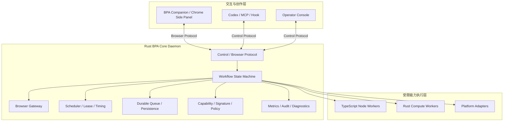

# BPA Rust Core Runtime：架构、性能与工程规范 v0.1

> **条件式方案标注（2026-08-06）**
>
> Rust 没有被废除，但本方案当前处于延后评估状态。以
> `docs/normative/bpa-product-form-v1.md` §8.1 和
> `docs/normative/bpa-roadmap-v1.md` 阶段 0 为准：先完成测量、预编译、进程收敛、
> 事件驱动与真实泄漏修复。只有准入证据证明 Node Core 仍无法满足产品 SLO，或需要
> 更强的原生安全/隔离边界时，才批准启动独立 Rust Core。下文描述的是**准入后的候选
> 目标架构**，不是当前已批准的生产迁移。

## 状态

- 权威等级：迭代计划
- 实现状态：计划中
- 决策日期：2026-08-06
- 目标版本：BPA `0.7+`，具体切换版本待性能基线和纵向闭环验证后确定
- 条件式目标：如果 Rust 准入门禁成立，BPA Core 演进为独立 Rust Core Daemon；
  不采用逐文件翻译，不把整个 BPA 或浏览器自动化全部改写为 Rust
- 迁移原则：先完成可独立工作的最小纵向闭环，再逐层接管 Durable Queue、Lease、
  Browser Gateway 和 Workflow Engine；切换后删除旧实现，不保留长期双栈兼容层
- 不改变的安全边界：页面内容是不可信数据；发布必须由人确认；阻断风险停止执行；
  外部写入结果不确定时不得自动重试；旧 fencing token 不能覆盖新所有权

本文将 2026-08-06 的性能讨论固化为详细工程方案。它描述目标架构、Rust 编码标准、
进程形态、并发和持久化模型、迁移顺序、性能 SLO、安全交付与验收方式。本文不是
“Rust 已经投入生产”的证明；除现有 `@bpa/inventory-kernel` 外，Rust Core 仍为计划。

## 1. 决策摘要

BPA 不应长期让一个 Node.js 事件循环同时承担高频 Browser Gateway 调度、同步
SQLite 持久化、Workflow Runtime、Trigger、Control Protocol、Page Observation、
证据和数据集服务。当前结构在低负载下能够工作，但会把数据库扫描、JSON 处理、
浏览器消息和控制请求放在同一延迟域中。一旦历史表、页面观测或待处理命令增长，
Control 请求、租约续约和浏览器执行会一起变慢。

如果阶段 0/1 的证据触发 Rust 准入，目标不是因为“Rust 更快”就重写一切，而是将
BPA 的确定性运行权威收敛为一个独立、可签名、可恢复、可观测的 Rust Runtime：

1. Rust Core 是运行状态、租约、fencing、调度、幂等和恢复的唯一权威。
2. Chrome Extension、Companion、MCP、变化频繁的 Node 和平台 Adapter 继续使用
   TypeScript 或最适合其生态的语言。
3. 高计算能力继续采用 Rust Native Kernel 或独立 Rust Worker。
4. Runtime Core 采用独立进程协议边界，不以 Node-API 作为主要承载形态。
5. 平台业务特例不得进入 Rust Core；抖店、淘宝、蝉妈妈等差异只存在于 Node 和
   Adapter。
6. 迁移过程允许只读影子比较，但生产写入者始终只能有一个。

## 2. 当前性能信号

### 2.1 2026-08-06 初始观察

以下是一次 macOS Activity Monitor 快照，不是稳定基准，也不能直接等价为整机 CPU
占比。macOS 中单进程 `100%` 通常约等于占满一个逻辑核心。

| 进程 | CPU | 内存 | 初步解释 |
| --- | ---: | ---: | --- |
| `node` | 69.6% | 152.9 MB | Core 或库存 Node 子进程；需要按 PID 和采样剖析进一步归因 |
| `WindowServer` | 38.0% | 70 MB | 图形合成；Rust Core 不会直接消除此开销 |
| `ScreensharingAgent` | 37.8% | 45.7 MB | 屏幕共享编码与传输；属于独立性能域 |
| Chrome for Testing Helper | 34.9% | 196 MB | 页面渲染、DOM、Content Script 和自动化执行 |
| `mds_stores` | 15.4% | 40.8 MB | Spotlight 索引；需要排除构建目录和高频日志的影响 |

因此性能治理必须至少分成四条线：

- Rust/Node Runtime 控制面。
- Chrome 与 Extension 页面观测。
- WindowServer 与屏幕共享。
- 文件、构建产物、日志和 Spotlight 索引。

只重写 Core 不能自动解决后三项，但 Core 拥塞会放大浏览器重连、重复 probe、租约
超时和不确定请求，因此仍然是最高价值的长期改造方向。

### 2.2 已从代码确认的结构事实

以下为当前仓库可直接确认的事实：

1. `apps/local-core/src/main.ts` 每 500ms 调用一次 `browserGateway.tick()`，每两个
   tick 调用 Trigger，并尝试 drain IR2 Runtime。
2. `packages/persistence-sqlite` 使用同步 `better-sqlite3`；数据库查询、事务和 JSON
   编解码与 Control Server、Gateway 共用 Node 主线程。
3. `browserGateway.tick()` 会多次读取 pending commands、terminal results、cancelled
   runs 和 engine outbox。
4. `engine_outbox` 当前轮询条件是 `acknowledged_at IS NULL`，`gateway_commands`
   当前轮询条件是 `state != 'terminal'`；对应状态过滤没有专用索引。
5. Extension 每 10 秒 probe 全部来源标签页；Content Script 同时使用
   `MutationObserver` 并在变化后进行防抖观察。
6. `packages/persistence-sqlite/src/index.ts` 已超过 6500 行，说明存储职责和运行域
   已经高度集中。

### 2.3 仍需性能剖析确认的推断

以下是高可信推断，但在进入实现前必须通过真实负载采样确认：

- 500ms 固定轮询在历史表增长后产生重复扫描和 JSON 反序列化。
- 同步 SQLite 长事务阻塞 Control Socket 消息处理。
- Browser Observation 重复写入增加 WAL、索引和事件循环压力。
- Gateway tick 与 Browser Result 提交互相争夺同一 Node 事件循环。
- Control 请求超时与租约续约延迟至少部分来自 Core 排队，而不只是浏览器慢。
- 频繁生成诊断、构建产物或日志可能引发 `mds_stores` 额外索引负载。

禁止在没有 CPU Profile、查询计划和队列指标的情况下，把全部 69.6% CPU 归因于某
一段代码。

## 3. 目标与非目标

### 3.1 目标

- 将 BPA Core 建设为低延迟、可恢复的本地可信运行内核。
- 从架构上隔离浏览器、Worker、Adapter 和 Core 故障。
- 用类型系统表达身份、所有权、租约和状态机不变量。
- 使用有界队列、背压、单写所有权和事件唤醒替代高频全表轮询。
- 建立 macOS arm64 与 Windows x64 的签名二进制交付闭包。
- 保持 Workflow、Node、Adapter 和 Runtime Primitive 的工程边界。
- 在任何重启、超时和重复消息下保持幂等、fencing 和不确定写入安全。
- 让性能退化可以被指标定位，而不是等到 30 秒请求超时后才被发现。

### 3.2 非目标

- 不把 Chrome Extension 或 DOM 自动化改写为 Rust。
- 不把所有 Node、Adapter、MCP 和 UI 编译进 Core。
- 不因为 Rust 化而改变已有风险和人工发布边界。
- 不承诺网络请求、登录等待或页面渲染会因为 Rust 自动加速。
- 不在第一版引入分布式微服务、通用集群编排或远程一致性协议。
- 不以代码混淆或 Rust 二进制替代真正的权限、签名和密钥管理。

## 4. 架构原则

### 4.1 Core 只负责确定性权威

Core 负责：

- 命令接收与协议校验。
- Workflow 状态机。
- Run、Step、Attempt 和 Execution Identity。
- Lease、fencing token、timeout 和 cancellation。
- Durable Inbox/Outbox。
- Browser Session、Page Binding 和命令串行化。
- Capability、Policy、签名和发布状态校验。
- Checkpoint、恢复、审计和运行指标。

Core 不负责：

- 某个平台的 DOM selector。
- 抖店、淘宝或蝉妈妈的登录和业务语义。
- 商品、订单、库存等业务规则。
- LLM Prompt 和会话生成逻辑。
- 具体外部 API 的签名、分页和字段归一化。

### 4.2 业务能力存在于 Node 和 Adapter

```text
Workflow
  → Versioned Node Definition
    → Runtime Primitive / Worker Capability
      → Adapter / Browser / HTTP / Filesystem / Data Kernel
```

- Workflow 描述编排、依赖、失败策略和恢复点。
- Node 描述单一、可版本化和可测试的能力。
- Adapter 负责平台认证、限流、分页、页面/API 差异和原始数据归一化。
- Runtime Primitive 只提供受限 HTTP、原子文件、签名校验、受控进程和 Browser
  dispatch 等机制。

HTTP POST 不是 Adapter 的替代品。File Write 也不是任意路径写入；它必须绑定受控
根目录，采用临时文件和原子替换，并记录最终结果是否可以确认。

### 4.3 运行状态与业务事实分离

必须分别建模：

- Runtime 是否成功。
- 数据是否完整。
- 数据是否新鲜。
- 业务风险是否确定。
- 页面或登录是否阻断。

部分数据已持久化不能显示成“无数据”；`unknown` 不能被解释为安全；Runtime 成功也
不能自动证明 13 店库存完整。

### 4.4 单一写入权威

迁移、影子比较和回放都不得产生两个生产写入者：

- 同一时刻只能有一个 Core 持有生产 Runtime ownership。
- 影子 Runtime 只消费脱敏快照或事件副本，不取得生产 Browser Control Lease。
- 旧 fencing token 永远不能确认新执行的结果。
- 切换完成后删除旧 Node Core 路径，不长期维护双协议和双存储实现。

## 5. 最终应用形态

采用“Rust 模块化单体 Core + 外部 Worker”的形态：



### 5.1 为什么是独立 Daemon

Core 采用独立 Rust 进程，而不是主要依赖 Node-API：

- 可以真正移除 Node 事件循环对 Core 延迟的影响。
- Rust Core 崩溃与 TypeScript Worker 崩溃互相隔离。
- 可以单独签名、校验和限制 Core 二进制。
- macOS 使用 Unix Socket，Windows 使用 Named Pipe，协议语义不依赖传输。
- Worker 可以按权限、资源和超时独立管理。
- Core 可以在没有 UI、MCP 或开发工具时持续运行。

Node-API 继续适合批量纯计算内核，例如现有 Inventory Kernel；它不作为 Runtime
Core 的主要承载方式。

### 5.2 为什么不是微服务

本地 Runtime 不需要把 Engine、Gateway、Scheduler 和 Store 分拆成多个长期服务。
它们共享强一致性状态和恢复边界，过早分布式化会引入：

- 跨进程事务。
- 更多部署和版本协商。
- 更复杂的故障矩阵。
- 不必要的网络和序列化开销。

内部保持模块化，外部保持单个 Core Daemon。只有不可信、可能阻塞、平台相关或高
计算能力才进入 Worker 进程。

## 6. Core 模块边界

| 模块 | 职责 | 禁止承担 |
| --- | --- | --- |
| Protocol | framing、大小限制、deadline、身份、Schema 校验 | 业务规则、SQL |
| Runtime Domain | Command、Event、State、Invariant | Socket、文件、数据库连接 |
| Engine | 纯状态转换、Step/Attempt、retry/cancel 语义 | 平台 API、DOM |
| Scheduler | deadline、lease、fencing、timing wheel | 业务定时脚本 |
| Browser Gateway | session、binding、dispatch、result、每 Tab 串行 | selector、页面业务解析 |
| Store Port | 原子 UoW 和读取契约 | SQLite 特有 SQL 泄漏到领域层 |
| SQLite Adapter | WAL、Migration、Inbox/Outbox、Checkpoint | Workflow 业务判断 |
| Worker Broker | 进程、能力、权限、资源和取消 | 直接信任 Worker 输出 |
| Security | 签名、Capability、Policy、设备身份 | 在二进制内保存长期密钥 |
| Telemetry | metrics、trace、结构化诊断 | 复制敏感正文和凭据 |

## 7. 领域建模

### 7.1 用类型表达身份和所有权

Core 内部不得用裸 `String` 和 `u64` 混用关键身份：

```rust
#[derive(Clone, Debug, Eq, PartialEq, Hash)]
pub struct RunId(Uuid);

#[derive(Clone, Debug, Eq, PartialEq, Hash)]
pub struct BrowserInstanceId(Uuid);

#[derive(Clone, Copy, Debug, Eq, PartialEq, Ord, PartialOrd)]
pub struct FencingToken(u64);

#[derive(Clone, Debug, Eq, PartialEq, Hash)]
pub struct LeaseKey(String);
```

每个标识只允许通过校验构造函数创建；解析失败必须停留在协议边界。

### 7.2 让非法状态无法构造

使用枚举表达互斥状态：

```rust
pub enum LeaseState {
    Available,
    Held {
        owner: OwnerId,
        fencing_token: FencingToken,
        expires_at: Timestamp,
    },
}
```

禁止用多个 `Option` 和布尔值拼出互相矛盾的状态，例如同时出现
`owner = Some(...)`、`fencing_token = None`、`expired = false`。

### 7.3 Command 与 Event 分离

Command 表示请求，Event 表示已经被 Core 接受的事实：

```rust
pub enum RuntimeCommand {
    StartRun(StartRun),
    CancelRun(CancelRun),
    RenewLease(RenewLease),
    AcceptBrowserResult(AcceptBrowserResult),
}

pub enum RuntimeEvent {
    RunStarted(RunStarted),
    StepDispatched(StepDispatched),
    LeaseRenewed(LeaseRenewed),
    BrowserResultAccepted(BrowserResultAccepted),
    RunCompleted(RunCompleted),
}
```

核心状态转换尽量保持纯函数：

```rust
pub fn decide(
    state: &RunState,
    command: RuntimeCommand,
) -> Result<Vec<RuntimeEvent>, DomainError>;

pub fn apply(state: &mut RunState, event: &RuntimeEvent);
```

协议、数据库和 Tokio 类型不得进入 `decide`。这样才能对状态机做快速单元测试、
属性测试、事件回放和 TypeScript/Rust 黄金一致性验证。

### 7.4 明确失败语义

必须长期分离：

```rust
pub enum DispatchFailure {
    RejectedBeforeExecution,
    AuthenticationRequired,
    RiskControlBlocked,
    ObservationStale,
    LeaseLost,
    DeadlineExceeded,
    ResultUncertain,
    WorkerUnavailable,
}
```

- `RejectedBeforeExecution` 可以在策略允许时重新构造新命令。
- `ResultUncertain` 不能自动重试外部写。
- `AuthenticationRequired` 和 `RiskControlBlocked` 必须转人工处理。
- `LeaseLost` 立即停止所有新外部动作。
- 数据读取可以返回 partial，但必须带覆盖率和证据。

## 8. 并发模型

### 8.1 Tokio 只作为执行器

Rust Core 可采用 Tokio 处理 Socket、Timer、Process 和异步 I/O，但领域模型不能依赖
Tokio。异步运行时负责调度，不负责定义业务状态。

### 8.2 所有权优先于共享锁

禁止把 Core 构造成大量：

```rust
Arc<Mutex<HashMap<...>>>
```

推荐采用有界 Channel 和单所有者 Actor：

- 一个 SQLite Writer Actor。
- 一个 Scheduler Actor。
- 每个 Browser Session 一个 Session Actor。
- 每个受控 Worker 一个 Supervisor。
- 查询使用只读连接池或不可变快照。
- 每个 Tab 的 Browser Command 严格串行。

### 8.3 所有队列必须有界

每条 Channel 必须定义：

- 容量。
- 满载策略。
- 是否允许丢弃。
- deadline。
- 指标。
- shutdown 行为。

控制命令、浏览器结果和持久化事件不得静默丢弃。可重建的页面观测允许按
`browserInstance + tab + pageEpoch` 合并旧版本，但必须保留最新状态和风险变化。

### 8.4 事件唤醒替代固定扫描

正常调度采用：

- 新 Outbox 提交后立即唤醒 dispatcher。
- Timer Wheel/Delay Queue 唤醒到期任务。
- 空闲时不进行 500ms 全表扫描。
- 崩溃恢复时执行一次有界 backlog scan。
- 运行期间按游标和 LIMIT 增量读取。
- 低频 reconciliation 只用于校验遗漏，不承担主调度。

## 9. 持久化模型

### 9.1 本地默认 SQLite

SQLite 仍适合作为单机 BPA Runtime 的默认存储，但使用方式必须改变：

- WAL 模式。
- 单写所有权。
- 明确读写事务范围。
- Prepared Statement 复用。
- pending/due 查询使用 partial index 或覆盖索引。
- 所有队列读取使用 LIMIT 和稳定游标。
- 历史数据设置可审计的保留与压缩策略。
- 大型正文和证据继续保存于内容寻址文件存储，SQLite 只保存元数据和引用。

### 9.2 Durable Inbox/Outbox

外部效果的基本顺序：

1. 在同一事务中保存状态变化和 Outbox。
2. 提交成功后唤醒 dispatcher。
3. dispatcher 发送带 idempotency key 和 fencing token 的命令。
4. Worker/Extension 返回稳定 result identity。
5. Core 在同一事务中保存 Inbox、结果和后续状态。
6. 重复结果按 identity 返回 duplicate，不重复应用。

数据库提交前不得发送外部效果。收到结果但数据库未确认时，重连必须依赖相同
identity 重放，而不是生成新命令。

### 9.3 近期 Node Core 的永久优化

在 Rust Core 完成前，现有 Node Core 应先完成独立且长期有效的治理：

- 对 `engine_outbox` pending 查询增加 partial index。
- 对 `gateway_commands` non-terminal 查询增加 partial index。
- 为 terminal-result application 查询验证 join 和 status 索引。
- 所有 pending 查询增加 LIMIT、游标和批次上限。
- 将固定 500ms 全扫描改为事件唤醒与空闲退避。
- 对 Page Observation 做状态和 revision 去重。
- 对相同 Session/Tab 的重复读取复用单次查询结果。

候选索引必须先使用生产副本执行 `EXPLAIN QUERY PLAN` 和基准验证；不能仅凭 SQL
文本直接进入生产。

## 10. Browser Gateway 与 Extension 性能

### 10.1 Rust Browser Gateway 负责什么

- Extension handshake、设备和实例身份。
- Session resume token。
- 消息 sequence 和幂等。
- Page Binding 和 observation revision。
- Browser Control Lease。
- 每 Tab 命令串行化。
- dispatch、timeout、cancel 和 result acceptance。
- 背压、队列深度和重连恢复。

它不解析抖店 DOM，也不保存 Cookie。

### 10.2 Extension 的独立治理

Rust Core 不会自动降低 Chrome Helper 或 WindowServer CPU。Extension 需要同步治理：

- 无活动 Run 时停止全标签页固定 10 秒 probe，改为事件驱动或低频健康检查。
- 页面未变化时不重复发送相同 observation。
- MutationObserver 只观察必要容器，不默认监听整棵 DOM 子树。
- 页面变化采用单次合并防抖，禁止并发 probe 同一 Tab。
- 只维持工作流需要的商品页、订单页和派生 Tab。
- 观测消息必须有速率、合并数和丢弃数指标。
- 页面处于 auth、CAPTCHA 或 risk-control 时停止新的浏览器动作。

### 10.3 屏幕共享和系统进程

`WindowServer` 与 `ScreensharingAgent` 是独立性能域：

- 记录远程桌面是否连接、分辨率和帧率。
- 对比有/无屏幕共享时 Chrome 与 Core 的 CPU。
- 需要长期远程观察时，优先降低分辨率和帧率。
- 不默认采用 headless Chrome；抖店登录、扩展、风控和页面行为必须完成平台 E2E
  后才能决定。
- 将构建目录、Native target 和高频临时日志纳入 Spotlight 影响评估，但不能在没有
  数据时随意关闭系统索引。

## 11. Protocol 设计

### 11.1 单一 Schema 来源

`packages/schemas/schema/` 继续作为协议 Schema 权威来源。Rust 与 TypeScript 类型都
从同一 Schema 派生或通过同一夹具校验，禁止维护两套手写字段定义。

Rust 边界类型使用 `serde`，但领域层避免 `serde_json::Value`。JSON 只停留在：

- Control Protocol。
- Browser Protocol。
- Worker Protocol。
- 数据库存储序列化。
- 审计与诊断边界。

### 11.2 每个请求必须具备

- protocol version。
- request/message identity。
- actor/device identity。
- deadline。
- 最大 body 大小。
- capability 或 permission context。
- 可选 idempotency key。
- 稳定错误码。

### 11.3 升级原则

- 新版本在发布闭包中同时交付 Core、协议类型、Extension 和 Worker manifest。
- 不增加长期 protocol fallback、旧 Socket 路径或双格式解析。
- 升级前备份运行数据并进行离线校验。
- 切换前完成协议夹具和安装升级演练。
- 切换后删除旧实现和旧入口；发现问题使用完整版本回滚，不在运行时动态降级到旧
  协议。

## 12. Rust 工程结构

初期只建立足够支撑纵向闭环的 crate：

```text
rust/
├── bpa-core/                 # 二进制入口、依赖组装、生命周期
├── bpa-runtime/              # Domain、Engine、Scheduler、Gateway 模块
├── bpa-protocol/             # Control、Browser、Worker 边界类型
└── bpa-store-sqlite/         # SQLite Adapter、Migration、Inbox/Outbox
```

现有 `packages/inventory-kernel` 继续作为独立计算内核，不并入 Core 领域代码。

只有满足以下至少一项时才拆新 crate：

- 形成独立安全边界。
- 具有独立发布或目标平台需求。
- 被两个以上最终组件复用。
- 编译和依赖边界确实需要隔离。

禁止为了“看起来架构化”提前建立数十个空 crate、trait 和通用框架。

## 13. Rust 编码规范

### 13.1 简单实现优先

- 先写清楚的具体类型，再考虑泛型。
- 只有两个真实实现出现时才抽象 trait。
- 不为假设中的云集群、远程数据库或第三种浏览器预建扩展点。
- 长期架构边界必须正确，但内部实现采用满足当前需求的最小结构。

### 13.2 错误处理

- 领域和基础设施错误使用 `thiserror` 或等价的显式枚举。
- `anyhow` 只允许在二进制入口、启动和最终进程退出层。
- 禁止用错误字符串驱动核心状态机。
- 稳定 error code 与人类 diagnostic 分离。
- 错误不得包含 Cookie、Token、数据库 URL、验证码或敏感正文。

### 13.3 `unsafe` 策略

- Core 业务代码默认禁止 `unsafe`。
- FFI 或平台系统调用若必须使用 `unsafe`，集中在小型模块。
- 每个 `unsafe` block 必须写明 safety invariant。
- 对外部二进制和 FFI 输入做大小、范围和生命周期校验。

### 13.4 异步规范

- 不在 async task 中执行阻塞 SQLite、文件压缩或 CPU 密集计算。
- 阻塞工作进入专用线程或 Worker。
- 所有 spawned task 必须有 owner、取消和 shutdown 路径。
- 禁止无界 `tokio::spawn`。
- 重要 task panic 必须由 Supervisor 观察并转为运行故障。

### 13.5 依赖标准

- 优先选择成熟、维护稳定且许可证可接受的库。
- 使用依赖前检查现有项目依赖和能力，不重复实现常见协议、SQLite 和加密能力。
- 每个新增依赖记录用途、功能开关、许可证和供应链影响。
- 关闭不需要的 default features，减少二进制和攻击面。

### 13.6 风格和文档

- `rustfmt` 是唯一格式标准。
- `clippy --all-targets -- -D warnings` 必须通过。
- 公共类型和关键 invariant 必须有 rustdoc。
- 注释解释“为什么”和安全边界，不重复代码表面行为。
- 避免缩写堆叠；身份、所有权和时间语义使用完整命名。

## 14. 可观测性

Core 必须原生输出结构化指标，而不是依赖日志猜测：

### 14.1 Runtime 指标

- Control request count、duration、timeout、in-flight。
- Command enqueue 和 commit duration。
- Inbox/Outbox pending、oldest age、batch size。
- SQLite read/write duration、busy、WAL size、transaction duration。
- Gateway tick/dispatch/result duration。
- Browser Session count、reconnect、observation rate、deduplicated count。
- Lease renewal latency、remaining TTL 和 loss reason。
- Worker queue depth、start duration、timeout、exit reason。
- Runtime CPU、RSS、open file/socket 和 task count。

### 14.2 Trace

统一传播：

- `trace_id`
- `request_id`
- `run_id`
- `step_instance_id`
- `command_id`
- `browser_instance_id`
- `fencing_token`

诊断输出默认不包含业务正文。需要查看证据时通过受控 Evidence 引用读取。

### 14.3 健康不等于业务成功

Core 健康接口只回答：

- 进程是否响应。
- 存储是否可读写。
- 队列是否在可接受延迟内。
- 调度和 Timer 是否推进。

它不能用来证明登录有效、13 店库存完整或预测新鲜。

## 15. 性能 SLO

以下为首版设计目标，最终阈值应由基准和生产容量确定：

| 指标 | 目标 |
| --- | ---: |
| 空闲 Core CPU | `< 2%` |
| 正常活动期 Core CPU | 通常 `< 20%` 单逻辑核心 |
| 本地只读 Control p95 | `< 50ms` |
| Durable Command 入队 p95 | `< 200ms` |
| Lease renewal p99 | 小于 TTL 的 `20%` |
| 空闲 Core RSS | `< 80MB` |
| Core 崩溃恢复到可服务 | `< 3s` |
| Pending queue | 有界，oldest age 可告警 |
| Browser command 串行冲突 | `0` |
| 旧 fencing token 被接受 | `0` |

浏览器页面等待、外部 API 延迟和 Worker 计算时间必须单独统计，不能算作 Core
内部处理时间。

## 16. 基准与剖析计划

### 16.1 基线采集

在不与生产采集重叠的受控窗口采集：

- 按 PID 区分 Core、库存子进程、Native Host 和 Worker。
- Node CPU Profile 和 event-loop delay。
- SQLite 表行数、索引、`EXPLAIN QUERY PLAN` 和查询耗时。
- 每秒 Browser Protocol 消息、Observation 和持久化次数。
- pending command/outbox 数量与 oldest age。
- 有无屏幕共享时的系统 CPU 对照。
- 空闲、单店、13 店和故障恢复四类负载。

### 16.2 可重复回放

建立脱敏协议回放夹具：

- Browser handshake、observation、dispatch、result。
- 大量历史 terminal commands 与少量 pending commands。
- Extension 瞬时断连和恢复。
- timeout、cancel、duplicate 和 stale fencing。
- 13 店库存工作流的控制事件序列，不包含 Cookie 和页面敏感正文。

Node 优化和 Rust Core 必须在相同输入、相同机器和相同持久化规模下比较。

### 16.3 Rust Benchmark

- 纯 Engine transition 使用 Criterion。
- Protocol framing 和 Schema 校验单独基准。
- Inbox/Outbox commit 使用真实 SQLite 临时数据库。
- Gateway dispatch 使用受控 Session fixture。
- crash recovery 使用真实进程和数据库副本。
- 禁止用纯内存 mock 代替持久化性能结论。

## 17. 测试与正确性门禁

### 17.1 必须成立的属性

- 同一 Command 重复提交不产生两个外部效果。
- 同一 Browser Result 重复到达只应用一次。
- 旧 fencing token 永远不能更新新所有权状态。
- 未确认外部写不自动重试。
- 同一 Tab 同时最多一个执行命令。
- Core 重启不会丢失已提交 Event 或 Outbox。
- pending、partial、blocked、unknown、failed 和 uncertain 不互相混淆。
- shutdown 不接受新命令，并在边界内完成或留下可恢复状态。

### 17.2 测试层次

1. 纯领域单元测试。
2. `proptest` 状态机属性测试。
3. SQLite 真实事务和 Migration 测试。
4. Protocol fixture 与 TypeScript/Rust 一致性测试。
5. Worker/Extension 模拟进程集成测试。
6. `SIGKILL`、磁盘满、重复消息和乱序消息故障注入。
7. macOS arm64 与 Windows x64 安装闭包测试。
8. 真实浏览器平台 E2E。
9. 受控生产 canary。

`loom` 仅用于确实存在自定义并发原语的窄模块，不把全部业务测试建立在复杂并发
模拟之上。

## 18. 安全、加固与交付

### 18.1 Rust 能提供什么

- 内存安全和更明确的所有权。
- 更小、更独立的 Runtime 进程边界。
- 更容易形成签名二进制和最小交付闭包。
- 提高静态逆向和篡改成本。

Rust 不能让算法不可逆向，也不能安全保存嵌入二进制的永久密钥。

### 18.2 生产闭包

公司设备只交付：

- 签名的 Rust BPA Core。
- 必需的受限 Worker Runtime。
- 构建后的 Extension 和 Native Host/Bridge。
- 已发布 Workflow、Node manifest、Schema 和 Policy。
- 精确版本 Manifest、SHA-256、SBOM 和签名。
- 设备身份和最小权限运行配置。

不交付：

- 完整源码仓库。
- 测试、benchmark source 和开发文档。
- source map。
- 签名私钥。
- 长期通用凭据。
- 不参与运行的开发依赖。

### 18.3 平台交付

- macOS arm64：codesign、notarization、固定安装目录和 launchd。
- Windows x64：Authenticode、当前用户安装、Named Pipe ACL 和服务生命周期。
- 每个安装包执行离线 manifest、签名、Schema、SQLite 和自检验证。
- 升级前备份运行数据；失败时回滚整个已签名版本，不混装新旧 Core 组件。

## 19. 分阶段实施

### Phase 0：生产性能基线

交付：

- PID 级 CPU/RSS 证据。
- Node CPU Profile 和 event-loop delay。
- SQLite 查询计划、表规模和热点排行。
- Browser Protocol 消息频率。
- 屏幕共享对照数据。
- 可重复脱敏回放夹具。

退出条件：能够解释主要 CPU、Control p95 和 30 秒超时来自哪里。

### Phase 1：现有 Node Core 永久治理

交付：

- pending 查询索引和 LIMIT/游标。
- 事件唤醒与空闲退避。
- Observation 去重和 Extension 空闲降频。
- Core 性能指标。
- 生产副本基准和安全发布记录。

退出条件：当前生产链路在不依赖 Rust Core 的情况下先恢复可接受延迟。

### Phase 2：Rust 最小纵向闭环

只实现：

1. Core 启动、固定路径和单实例锁。
2. Control Protocol framing。
3. `health.inspect`。
4. SQLite 初始化。
5. Lease acquire/renew/release。
6. 一个 Durable Outbox。
7. 一个模拟 Worker Command/Result。
8. 进程 kill 后恢复。
9. metrics 和结构化日志。

退出条件：它是一个独立可安装、可恢复的最小产品，而不是空框架。

### Phase 3：Durable Runtime Kernel

迁移：

- Inbox/Outbox。
- Lease/fencing。
- Scheduler/Timing Wheel。
- Worker Broker。
- Checkpoint 和恢复。

退出条件：控制命令和 Worker 指令由 Rust Core 成为唯一写入权威。

### Phase 4：Rust Browser Gateway

迁移：

- Session handshake/resume。
- Observation registry。
- Binding、Control Lease 和 per-tab serialization。
- dispatch/result/cancel/timeout。
- Extension 断连恢复。

退出条件：真实浏览器 E2E 和故障恢复通过，Node Browser Gateway 不再参与生产。

### Phase 5：Rust Workflow Engine

迁移：

- IR2 状态转换。
- foreach、retry、deadline、cancel。
- assistance/human wait。
- Effect 生成和 checkpoint。

使用同一黄金夹具做 TypeScript/Rust 只读影子比较。生产仍只使用一个 Engine 写入。

退出条件：黄金一致性、属性测试、恢复测试和库存工作流 E2E 全部通过。

### Phase 6：正式切换和删除旧路径

- 冻结发布版本。
- 备份并完成恢复演练。
- 安装签名 Rust Core。
- 执行单一 canary Workflow。
- 扩大到库存完整生产周期。
- 达到稳定窗口后删除旧 Node Core、旧 Socket 和旧启动入口。

不保留永久 fallback。需要回滚时回滚整个已签名版本和对应数据备份。

## 20. 第一条纵向业务验收

库存工作流是首个 Rust Core 业务验收，但不把库存业务写入 Core。验收链路为：

```text
launchd
→ Rust Core Trigger/Lease
→ Published Inventory Workflow
→ TypeScript/Rust Worker Nodes
→ Browser Gateway
→ Extension
→ PostgreSQL 业务事实
→ Run/Step/Event 回写 Rust Core
```

验收必须区分：

- Rust Core 运行正确。
- Browser Gateway 正确。
- 订单和库存是否实际持久化。
- 13 店覆盖率和新鲜度。
- 风险结果是否为确定性结论。

Core 低 CPU 不能代替库存生产验收；库存成功也不能代替 Core crash recovery 证据。

## 21. 验收清单

### 架构

- [ ] Rust Core 是生产 Runtime 唯一写入权威。
- [ ] Core 不包含平台特有业务分支。
- [ ] Runtime、Node、Adapter、Workflow 和数据事实边界通过架构测试。
- [ ] 不存在长期双 Core、双协议或旧路径 fallback。

### Rust 质量

- [ ] `cargo fmt --check` 通过。
- [ ] `cargo clippy --all-targets -- -D warnings` 通过。
- [ ] 公共类型和关键 invariant 有 rustdoc。
- [ ] `unsafe` 集中、可审计并写明 safety invariant。
- [ ] 领域层不依赖 Tokio、SQLite 和 `serde_json::Value`。
- [ ] 所有关键队列有界并有背压指标。

### 正确性

- [ ] 幂等、fencing、uncertain write 和 crash recovery 属性测试通过。
- [ ] TypeScript/Rust 黄金夹具一致。
- [ ] SQLite 真实事务、重复消息和乱序消息测试通过。
- [ ] Browser Session 断连、恢复、取消和 timeout 测试通过。

### 性能

- [ ] 空闲和活动 SLO 达标。
- [ ] 不再存在 500ms 全表轮询主调度。
- [ ] Control p95、Outbox age、SQLite duration 和 observation rate 可观测。
- [ ] Chrome、WindowServer、Screensharing 与 Core CPU 分别归因。

### 发布与安全

- [ ] macOS arm64 和 Windows x64 预编译产物通过实机门禁。
- [ ] 签名、checksum、SBOM 和 Runtime Closure 可验证。
- [ ] 安装包不含源码、source map、私钥和长期凭据。
- [ ] 升级、备份、回滚和卸载演练通过。

### 生产

- [ ] 库存 canary 只通过正式入口执行。
- [ ] 运行期间只有一个有效 Runtime、Browser 和业务租约所有者。
- [ ] 登录、CAPTCHA、风险或控制面异常保持 fail closed。
- [ ] 13 店库存、订单、预测和风险分别提供新鲜度与覆盖率证据。

## 22. 已作决定与待确认项

### 已作决定

| 编号 | 决定 |
| --- | --- |
| D1 | Rust 准入后采用独立 Rust Daemon，不采用逐文件翻译 |
| D2 | 采用模块化单体，不采用本地微服务拆分 |
| D3 | TypeScript 保留 Extension、Companion、Node 和 Adapter 生态 |
| D4 | Node-API 用于计算内核，不作为 Core 主要边界 |
| D5 | SQLite 采用单写所有权、有界队列和事件唤醒 |
| D6 | Core 内不出现平台业务特例 |
| D7 | 影子比较只读；正式写入者始终唯一 |
| D8 | 切换完成后删除旧 Node Core，不保留永久兼容层 |

### 待确认

| 项目 | 决策所需证据 |
| --- | --- |
| 是否启动 Rust Core | Node 预编译/进程收敛/事件驱动后的 SLO、稳定性和安全边界证据 |
| Rust Core 首次正式版本号 | Phase 0/1 基线和 Phase 2 纵向闭环进度 |
| SQLite Rust 库最终选择 | WAL、事务、Windows 文件锁和性能夹具比较 |
| Schema 到 Rust 类型生成工具 | 当前 JSON Schema 特性覆盖与生成代码质量 |
| 指标输出方式 | 本地运维、Console 消费和最小依赖要求 |
| Worker 沙箱强度 | macOS/Windows 可用系统能力和业务兼容性 |
| 空闲 Extension probe 策略 | 真实断连恢复、页面稳定性和 CPU 对照 |
| Rust Engine 切换稳定窗口 | 库存 E2E、故障注入和连续生产周期证据 |

## 23. 最终工程原则

> Core 只负责确定性、所有权、安全边界和恢复；业务能力通过版本化 Node 与受限
> Worker 执行。

优雅的 Rust 代码不是更多 trait、宏和 crate，而是：

- 领域状态明确。
- 非法状态难以构造。
- 副作用边界可见。
- 并发所有权简单。
- 失败语义精确。
- 协议和存储可替换但不泄漏到领域。
- 性能可以测量，恢复可以证明，发布可以验证。

Rust Core 只有在这些条件成立时才构成 BPA 的长期工程护城河；单纯把 TypeScript
逐行翻译为 Rust，不属于本方案。
